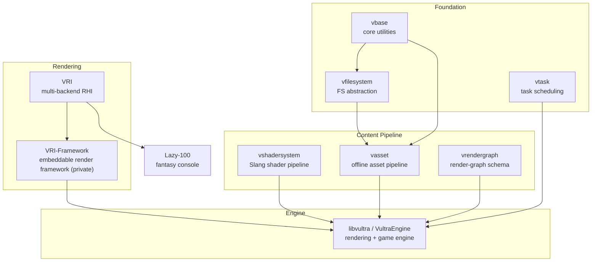

**Vultra** is not a single repository — it is an ecosystem of MIT-licensed, XMake-built C++ libraries that I design, write, and maintain, covering everything from foundation utilities to a cross-API render hardware interface and a modern rendering engine. Each piece is a standalone, reusable library; together they form the stack my PhD research and my games run on. This page is the single home for all of them: what each repo does, why it exists, and how they fit together.

## Origins

The story starts with [Snow Leopard Engine](/projects/snow_leopard_engine/), an OpenGL 4.6 group project at the University of Leeds. It taught me a lot — and left a lot to be desired: a legacy API, tightly coupled subsystems, and design decisions we could not undo late in the project. Modern graphics programming has decisively moved to explicit APIs like Vulkan, and when I began my PhD, the framework behind my research projects gradually matured. Those threads converged: instead of one monolithic engine, I rebuilt everything as an ecosystem of focused libraries. The vast majority of the code is handwritten; AI assistance came later for some of the tooling around it.

## Design Principles

- **Modularity and reuse.** Every library is split out as its own package precisely so that it can be reused by _any_ project — my research code, my games, other people's engines — rather than being owned by libvultra.
- **Offline-first content.** Heavy work (shader compilation, mesh optimization, texture compression) happens at import/build time, so the runtime stays lean and loading stays fast.
- **Full-platform ambition.** Desktop, Android, WebAssembly, and XR are all first-class targets, not afterthoughts.
- **Research-friendly.** You should be able to program against the stack the way you program against raylib — no editor, no project wizard, just code — which is exactly what rapid research prototyping needs.

## Why Not an Existing Solution?

I tried. **bgfx** is a product of an older era — its abstraction is built on OpenGL state-machine thinking, which forfeits the advanced features of modern graphics APIs. **Diligent Engine** and **The Forge** don't fully cover the API matrix I need, and neither exploits Slang's ability to compile a single shader source to every shading backend. **NRI** supports only Vulkan and DirectX. And none of them treat **OpenXR** as a design consideration — which, for someone whose research is high-performance VR rendering, was the final straw. So I wrote a RHI that satisfies my own requirements while aiming for the broadest platform support possible: [VRI](#vri).

## Architecture

---

## libvultra — The Engine {#libvultra}

**[GitHub](https://github.com/zzxzzk115/libvultra)** · **[Examples & Docs](https://zzxzzk115.github.io/libvultra/)**

libvultra is my answer to the regrets left behind by Snow Leopard: a more modern, more complete engine — built on explicit graphics APIs — serving **game development** and my **PhD research in high-performance VR rendering** at once. Three decisions define it:

- **FrameGraph / RenderGraph, not hand-wired passes.** Without a frame graph, resource reads and writes turn ambiguous and you drown in coupled OOP "Pass" classes; with one, the entire frame is declared explicitly and readable in one place. On the `dev-next` branch pipelines are fully **data-driven** — declarative `.vrg.json` files with a live-preview editor.
- **VR-first, via OpenXR.** Most engines still treat VR as a bolt-on. Here OpenXR stereo rendering is a first-class citizen, and the engine doubles as the research vehicle for stereo novel-view synthesis.
- **No editor required.** Usable the way raylib is: include the library, write code, get pixels — the difference between an afternoon and a week for research prototypes.

The `master` branch is the stable Vulkan core; `dev-next` — evolving under the name **VultraEngine** — adds a multi-backend RHI (Vulkan, WebGPU), Material Graph node editor, 3D Gaussian Splatting (including OpenXR scenes and foveated compositing), C++/Lua plugins, MCP-based AI-agent support, Jolt Physics, ozz-animation, and CI across Windows/Linux/macOS/Android/WASM.

## VRI — The Render Hardware Interface {#vri}

**[GitHub](https://github.com/zzxzzk115/VRI)** · **[Website](https://zzxzzk115.github.io/VRI/)**

Born out of disappointment with every existing cross-platform RHI: bgfx's state-machine-era abstraction, Diligent/The Forge's incomplete backend coverage and lack of Slang single-source shading, NRI's Vulkan/DX-only scope — and none of them considering OpenXR. VRI is one explicit, modern API (command buffers, descriptor sets, explicit synchronization) over **Vulkan, D3D12, Metal, WebGPU, OpenGL / GLES / WebGL 2, and CPU software rendering**.

- **C ABI core + header-only C++23 wrapper** — the C ABI makes P/Invoke bindings (C# and beyond) straightforward and guarantees ABI stability; the wrapper provides the day-to-day ergonomics.
- **Software rendering is a feature, not a fallback** — SwiftShader/Mesa backends let the full test suite run on GPU-less CI, and cover genuinely GPU-less machines.
- **Slang single-source shaders**, compiled offline to each backend's bytecode. **OpenXR** is already supported as an extension, with deeper integration living in VRI-Framework.
- Proof it works: [Lazy-100](/projects/lazy_100/), a complete fantasy console, runs entirely on VRI — on desktop and in the browser.

## VRI-Framework — The Embeddable Render Layer {#vri-framework}

_Private repository, under early development._

There is a wide gap between a raw RHI and a full engine: every renderer still needs a window, a swapchain loop, mesh/material data structures, and a way to get assets onto the GPU. VRI-Framework fills exactly that gap and deliberately nothing more — **not a game engine**, but a thin, reusable toolset. It offers two modes: a batteries-included `Application` loop for quick experiments, and an embeddable `RenderModule` driven by a host engine's own window and loop. Materials are pure data spanning multiple shading models; **shading is developer-owned** — no built-in uber-shader. Its destiny: **replace the rendering core inside libvultra**, existing as the framework/embeddable layer between VRI and the engine, with the deeper OpenXR integration for VR research living here too.

## vshadersystem — Shaders, Once, For Every Backend {#vshadersystem}

**[GitHub](https://github.com/zzxzzk115/vshadersystem)**

Single-source multi-backend shaders, keyword-permutation variants, and material parameter reflection are table stakes for an engine — and exactly what graphics research tools routinely neglect. The first generation used an INI-style DSL around GLSL, fine while libvultra (GLSL → SPIR-V/WGSL) was the only consumer; once VRI set out to support _every_ backend, v1.0 threw the DSL away and rebuilt on **Slang** (paired with SPIRV-Cross — a perfect match), with user-defined attributes carrying the metadata. Offline `vshaderc` compiles ahead of time to `.vshbin` (SPIR-V + WGSL) and `.vshlib` variant libraries; the lean runtime just loads. Full toolchain on desktop, runtime-only on Android/WASM.

## vasset — The Offline-First Asset Pipeline {#vasset}

**[GitHub](https://github.com/zzxzzk115/vasset)**

Loading source assets with Assimp at runtime doesn't cut it: data should be compressed (textures above all), and models need post-processing like meshoptimizer passes — at **import time**, not while the player waits. vasset is that import step: custom internal formats (VMesh / VTexture / VMaterial) shaped for loading speed, a UUID-based asset registry, a VPK packer bundling everything into one file, and VFS integration. Ships as both a library and CLI tools, cross-platform including WASM — the in-browser import demo was a technical test for interactive paper pages I may need in my research.

## vrendergraph — The Render-Graph Schema {#vrendergraph}

**[GitHub](https://github.com/zzxzzk115/vrendergraph)**

The **schema layer** of the render graph: a JSON format describing a whole pipeline — resources, passes, connections — and a tiny, deterministic runtime builder for it. libvultra's `.vrg.json` RenderGraph speaks exactly this format, but a pipeline description shouldn't be locked inside one engine, so it's a standalone library. An optional `meta` field stores editor UI state that the runtime ignores — the same file is both the shipping pipeline and the editable document — and resource selectors (`view`, `time`, `mip`, `layer`, `access`) are opaque to the library, interpreted by the consuming engine. The v0.3 schema (versioning, resource descriptors, pass conditions, view modes) was pushed by real pipeline needs: per-view resources for VR stereo rendering and history frames for TAA.

## vbase — The Foundation {#vbase}

**[GitHub](https://github.com/zzxzzk115/vbase)**

Every project re-implements the same handful of things — IDs, error handling, module wiring, events. vbase encapsulates the functionality I use most, once, properly: UUID, StrongID, `Result<T, E>`, BinaryReader/Writer, module/service registries, signals, an event bus. Its philosophy holds the whole stack together: minimal dependencies, **no global runtime state**, clear ownership, header-first, engine-independent.

## vfilesystem — Files, Everywhere {#vfilesystem}

**[GitHub](https://github.com/zzxzzk115/vfilesystem)**

A lightweight, composable filesystem abstraction on vbase: normalized UTF-8 forward-slash paths, uniform `IFile` / `IFileSystem` interfaces, physical / memory / platform-aware backends (desktop, Android, WASM), and a **VirtualFileSystem** mount table — the mechanism behind `res://`-style URIs. Strict non-goals (no asset loading, no streaming, no global locking) keep the boundary tight and the library composable; higher-level concerns belong to vasset.

## vtask — Parallelism {#vtask}

**[GitHub](https://github.com/zzxzzk115/vtask)**

Task scheduling encapsulated once for the whole ecosystem, built on **enkiTS** — a proven, battle-tested scheduler designed for exactly the workloads game engines have. Early and WIP; the API will grow as the ecosystem's parallelism needs (asset loading, render submission) take shape.

---

## Where It's Going

The long-term goal is an engine that is genuinely capable of **both shipping games and supporting research**:

- libvultra's rendering core will migrate onto **VRI / VRI-Framework**, completing the transition from its current Vulkan + WebGPU backends to the full cross-API stack.
- A private **VultraEngine** repository is developing a new architecture with **CoreCLR (C#) scripting**, opening the door to the C# ecosystem and making middleware integration far easier than Lua alone.
- The near-term research focus is **high-performance VR rendering** — stereo rendering, novel-view synthesis, and Gaussian Splatting in XR.
- In three to five years, this should be a mature engine.
