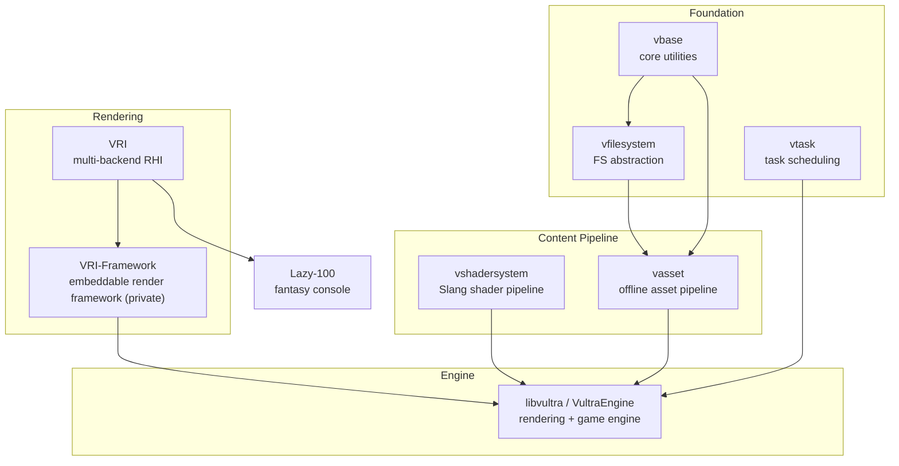

**Vultra** is not a single repository — it is an ecosystem of MIT-licensed, XMake-built C++ libraries that I design, write, and maintain, covering everything from foundation utilities to a cross-API render hardware interface and a modern rendering engine. Each piece is a standalone, reusable library; together they form the stack my PhD research and my games run on.

## Origins

The story starts with [Snow Leopard Engine](/projects/snow_leopard_engine/), an OpenGL 4.6 group project at the University of Leeds. It taught me a lot — and left a lot to be desired: a legacy API, tightly coupled subsystems, and design decisions we could not undo late in the project. Modern graphics programming has decisively moved to explicit APIs like Vulkan, and when I began my PhD, the framework behind my research projects gradually matured. Those threads converged: instead of one monolithic engine, I rebuilt everything as an ecosystem of focused libraries. The vast majority of the code is handwritten; AI assistance came later for some of the tooling around it.

## Design Principles

- **Modularity and reuse.** Every library is split out as its own package precisely so that it can be reused by _any_ project — my research code, my games, other people's engines — rather than being owned by libvultra.
- **Offline-first content.** Heavy work (shader compilation, mesh optimization, texture compression) happens at import/build time, so the runtime stays lean and loading stays fast.
- **Full-platform ambition.** Desktop, Android, WebAssembly, and XR are all first-class targets, not afterthoughts.
- **Research-friendly.** You should be able to program against the stack the way you program against raylib — no editor, no project wizard, just code — which is exactly what rapid research prototyping needs.

## Why Not an Existing Solution?

I tried. **bgfx** is a product of an older era — its abstraction is built on OpenGL state-machine thinking, which forfeits the advanced features of modern graphics APIs. **Diligent Engine** and **The Forge** don't fully cover the API matrix I need, and neither exploits Slang's ability to compile a single shader source to every shading backend. **NRI** supports only Vulkan and DirectX. And none of them treat **OpenXR** as a design consideration — which, for someone whose research is high-performance VR rendering, was the final straw. So I wrote a RHI that satisfies my own requirements while aiming for the broadest platform support possible: [VRI](/projects/vri/).

## Architecture

| Layer      | Project                                   | Role                                                                                                                            |
| ---------- | ----------------------------------------- | ------------------------------------------------------------------------------------------------------------------------------- |
| Foundation | [vbase](/projects/vbase/)                 | Minimal, engine-agnostic core: UUID, StrongID, `Result<T,E>`, module/service registries, signals — no global state.             |
| Foundation | [vfilesystem](/projects/vfilesystem/)     | Composable filesystem abstraction with virtual mounts; desktop, Android, and WASM backends.                                     |
| Foundation | [vtask](/projects/vtask/)                 | Task scheduling on top of the battle-tested enkiTS.                                                                             |
| Content    | [vshadersystem](/projects/vshadersystem/) | Slang-based shader compilation and material reflection — one shader source, every backend.                                      |
| Content    | [vasset](/projects/vasset/)               | Offline-first asset pipeline: import once, optimize offline, load instantly at runtime.                                         |
| Rendering  | [VRI](/projects/vri/)                     | Extensible RHI for Vulkan, D3D12, Metal, WebGPU, the OpenGL family, and CPU software rendering — with OpenXR support.           |
| Rendering  | [VRI-Framework](/projects/vri_framework/) | A minimal, embeddable rendering framework on VRI; the future rendering core of libvultra.                                       |
| Engine     | [libvultra](/projects/libvultra/)         | The engine itself: render graph, material graph, 3D Gaussian Splatting, OpenXR stereo rendering, plugins, AI-agent integration. |
| Proof      | [Lazy-100](/projects/lazy_100/)           | A fantasy game console built on VRI — proof that the stack can carry a complete, shippable product.                             |

## Where It's Going

The long-term goal is an engine that is genuinely capable of **both shipping games and supporting research**:

- libvultra's rendering core will migrate onto **VRI / VRI-Framework**, completing the transition from its current Vulkan + WebGPU backends to the full cross-API stack.
- A private **VultraEngine** repository is developing a new architecture with **CoreCLR (C#) scripting**, opening the door to the C# ecosystem and making middleware integration far easier than Lua alone.
- The near-term research focus is **high-performance VR rendering** — stereo rendering, novel-view synthesis, and Gaussian Splatting in XR.
- In three to five years, this should be a mature engine.
